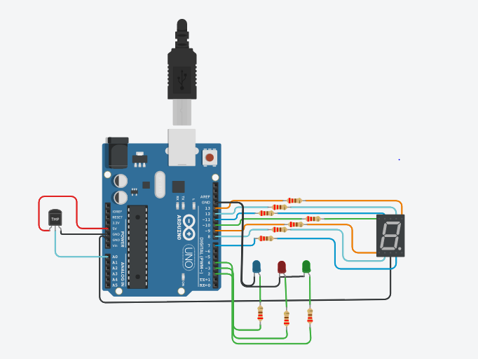

# Proyecto: Sistema que mida temperatura en camara frigorifica.

## Integrantes 
- Maximiliano Gomez
- Guido Gabriel Pascucci
- Martin Virun
- Ricardo Gonzalez
- Geronimo Camacho
- Emiliano Gorgellon

## Descripción
La funcion de este codigo, es informar al usuario el nivel, un numero exacto y atraves de los leds representamos un indicio de la temperatura dentro
solucionando todas las preguntas sobre la temperatura dentro de la cámara frigorífica.
Se agrego la funcionalidad de una tecla que en caso de estar prendida permite la funcion de los leds y display pero en caso de estar apagada no funcionaria.

## Función principal
Esta funcion se encarga de encender los leds y display segun la temperatura del sensor.
SENSOR_TEMPERATURA es un #define que utilizamos para leer los valores del sensor de temperatura asociado al pin de arduino. La funcion map permite que los valores del sensor pasarlos a grado celcius.

~~~ c (lenguaje en el que esta escrito)
void loop()
{
  valor_potenciometro = analogRead(A0);
  lecturaAnalogica = analogRead(SENSOR_TEMPERATURA);
  temperatura= map(lecturaAnalogica,20,358, -40, 125);
  Serial.print("La temperatura es : ");
  Serial.print(temperatura);
  Serial.println(" grados");
  switchA1 = digitalRead(A1);
  
  if(switchA1 == 0){
  	if(temperatura>24){
    printDigit('c');
    prenderLedRojo();
  	} 
  	else if(temperatura<0){
    printDigit('f');
    prenderLedAzul();
  	}
  	else
  	{
    printDigit('d');
    prenderLedVerde();
  	}
  	} else {
  	apagarDisplay();
    apagarLeds();
  	}
}

~~~

## :robot: Link al proyecto
- [proyecto](https://www.tinkercad.com/things/0U31T13dKQe-copy-of-empresa-frigorifica/editel?sharecode=Cw90pNXzL8RvYcMZEbBVsAhTxGaJD3d-tG8ycUFVjGc)
## :tv: Link al video del proceso
- [video](https://www.youtube.com/watch?v=CsbndeN2B_U)

---
